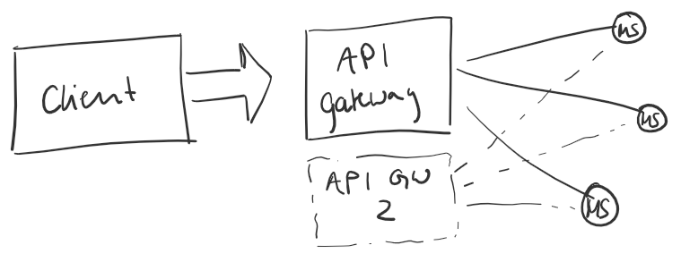
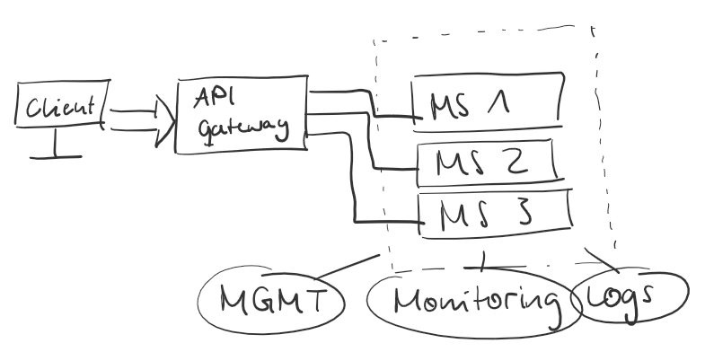

<!----------
title: "IT-Trends"
date: "Semester 3"
keywords: [IT-Trends, DHGE, Semester 3]
---------->

IT-Trends
=========

<!-- START doctoc generated TOC please keep comment here to allow auto update -->
<!-- DON'T EDIT THIS SECTION, INSTEAD RE-RUN doctoc TO UPDATE -->
**Inhaltsverzeichnis**

- [IT-Trends](#it-trends)
- [Einleitung](#einleitung)
	- [IT-Trends nach IDC](#it-trends-nach-idc)
	- [Disruptionen](#disruptionen)
	- [Agile Methoden](#agile-methoden)
	- [Cloud Computing](#cloud-computing)
		- [Edge Computing](#edge-computing)
	- [Künstliche Intelligenz](#künstliche-intelligenz)
	- [Agile Entwicklung und DevOps-Methoden als Schlüssel für hohe Entwicklungsgeschwindigkeit](#agile-entwicklung-und-devops-methoden-als-schlüssel-für-hohe-entwicklungsgeschwindigkeit)
	- [IT-Sicherheit](#it-sicherheit)
- [Technologien der dritten Plattform IT](#technologien-der-dritten-plattform-it)
- [Microservices und REST-Schnittstellen](#microservices-und-rest-schnittstellen)
	- [Microservices](#microservices)
	- [Dienste](#dienste)
	- [Technologie](#technologie)
	- [Pro/Contra Microservices](#procontra-microservices)
	- [Wer verwendet Microservices?](#wer-verwendet-microservices)
	- [API Gateways bei Microservices](#api-gateways-bei-microservices)
	- [Microservice Architektur Entwurf](#microservice-architektur-entwurf)
		- [Beispiel](#beispiel)
	- [Anforderungen an Microservices](#anforderungen-an-microservices)
	- [Kein Microservice anwenden wenn...](#kein-microservice-anwenden-wenn)
	- [Kriterien für eine geschickt gewählte Microservice Architektur](#kriterien-für-eine-geschickt-gewählte-microservice-architektur)
- [Service-Orientierte-Architekturen (SOA)](#service-orientierte-architekturen-soa)
	- [REST - Schnittstellen - Representational State Transfer](#rest---schnittstellen---representational-state-transfer)
		- [Eigenschaften von REST-Schnittstellen](#eigenschaften-von-rest-schnittstellen)
		- [Aufbau von REST-Anfragen](#aufbau-von-rest-anfragen)
		- [Übung](#übung)
- [Cloud Computing](#cloud-computing-1)
	- [Überblick](#überblick)
	- [Ursprung: Parallelisierung](#ursprung-parallelisierung)
		- [Cluster-Computing](#cluster-computing)
	- [GRID-Computing](#grid-computing)
	- [Warum (keine) Cloud](#warum-keine-cloud)
	- [Anwendungsmodelle](#anwendungsmodelle)
	- [IT-Aufbau](#it-aufbau)
	- [AWS-Einführung](#aws-einführung)
		- [S3 - Simple Storage Service](#s3---simple-storage-service)
		- [AWSCLI einrichten](#awscli-einrichten)
		- [Kostenberechnung AWS](#kostenberechnung-aws)
		- [Virtuelle Rechner im AWS anlegen](#virtuelle-rechner-im-aws-anlegen)
- [Machine Learning - KI, neuronale Netzwerke, ...](#machine-learning---ki-neuronale-netzwerke-)
	- [Einsatzgebiete](#einsatzgebiete)
	- [Mathe-Perspektive](#mathe-perspektive)
		- [Erkennen ohne Lernen](#erkennen-ohne-lernen)
		- [Erkennen durch Feature-Design](#erkennen-durch-feature-design)
- [Docker](#docker)
- [Blockchain und Verschlüsselung](#blockchain-und-verschlüsselung)
	- [Hashing](#hashing)
		- [Hashes knacken](#hashes-knacken)
	- [Verschlüsselung](#verschlüsselung)
		- [Digitale Signaturen](#digitale-signaturen)
		- [Digitale Zertifikat](#digitale-zertifikat)
	- [Blockchain](#blockchain)
		- [Bitcoin (Kryptowährungen)](#bitcoin-kryptowährungen)

<!-- END doctoc generated TOC please keep comment here to allow auto update -->

<!--newpage-->

# Einleitung

- Ziel des Moduls: Verstehen, analysieren und beurteilen von IT-Trends und Buzzwords darum
- LV-Aufteilung: 45LV gesamt
	- 3. Sem: 30LV
	- 4. Sem: 15LV
- Am Ende des 3. Sem.: Teilprüfungsleistung in Form einer kleinen Abhandlung über die Trends (Details noch offen)

## IT-Trends nach IDC

- KI-unterstützte GUIs: es wird versucht, die Absicht des Nutzers vorherzusagen und entsprechend Programmfunktionen zu empfehlen
- KI-unterstützte Prozessautomatisierung: KI-basierte Empfehlungen / Vorschläge / Werbung, wie auf Amazon oder sozialen Medien zu sehen ist
- bis 2032 sollen 75% der IT-Ausgaben in der "dritten Plattform der IT" liegen

## Disruptionen

- Marktänderungen mit großen Auswirkungen, die existenz-gefährdend oder -ermöglichend sind
- **Bsp.:** Digitalkameras waren eine Disruption der Kamerafilmindustrie, aber auch für Speicherkartenhersteller

## Agile Methoden

- Agile Methoden sind: DevOps, Microservices & Cloud Computing, KI in allen Unternehmensbereichen / Digitale Transformation
- Ziel: Bewährtes auf eine neue Qualitätsstufe heben und durch Neues anreichern

## Cloud Computing

<!-- width=350px -->

**Vorteile:**

- zentrale Datenverarbeitung
- schnelles Deployment
- unabhängig von lokaler Infrastruktur (-> dynamisch skalierbar)
- hohe Verfügbarkeit
- "Pay as you go"

### Edge Computing

<!-- width=350px -->


- Anwendung: "am Rand des großen Netzwerks" --> für Geräte, die nicht in einem Netzwerk liegen (z.B. IoT-Sensoren)
- Auslöser für Entwicklung:
	- höhere Rechen- und Übertragungsgeschwindigkeit
	- Verlangen nach Flexibilität
	- Agilität der IT

## Künstliche Intelligenz

...bzw. KI / AI / Neuronale Netze / ML / Deep Learning

- erfordern möglichst große Datenbasis
	- Folge: Unternehmen sammeln zum Teil extreme Datenmengen (vom Nutzer), was dann Big Data heißt
- Nutzen in IT-Operations / -Tool / -Prozessen
	- z.B. Ausfallvorhersage
- *sollte* unterstützend wirken, nicht ersetzend
- trifft üblicherweise Vorhersagen
	- Bsp.: Analyse des Kaufverhaltens bei Kartenzahlungen und Verkauf von Informationen für Werbezwecke

## Agile Entwicklung und DevOps-Methoden als Schlüssel für hohe Entwicklungsgeschwindigkeit

- DevOps = Development + Operations
	- ist Philosophie und Sammlung von Methoden
	- Ziel: schnelleres Wirksamwerden von Änderungen
- Scrum-Strategie:
	- Ziel: schnelle Projektanpassungen und Flexibilität
- beliebtes Werkzeug: Continuous Integration / Continuous Delivery
- Durch Cloudentwicklung ist das Release-Modell weniger relevant (laufende Aktualisierung, immer verfügbar, daher egal für Nutzer)

## IT-Sicherheit

...bzw. Informationssicherheit

- ist "Chefsache"
	- Firma haftet
	- muss vom Management organisiert werden
- Umsetzungshelfer: IT-Grundschutz-Zertifizierung
- soll nicht nur technisch sein --> Mitarbeiter-Training
- Reaktion auf Vorfälle ist nicht ausreichend, man braucht auch Prävention und Vorschau auf Attacken (Profiling, Analysieren von Auswirkungen, Planung)
- Personalrollen:
	- Datenschutzbeauftragter: organisiert, informiert, ist Ansprechpartner
	- Informationssicherheitsbeauftragter
	- Mitarbeiter: muss geschult sein und disziplinvoll handeln, damit Schutz wirksam
- ist ein Dauerprojekt
- Schutzziele:
	- **Integrität von Daten** = Manipulationsschutz
		- z.B. durch Hashes
	- **Vertraulichkeit der Daten** = Zugriffsbeschränkungen
		- auf Netzwerkebene
		- auf physischer Ebene
		- auf logischer Ebene --> Verschlüsselung, Betriebssystemfunktionen
	- **Verfügbarkeit der Daten**
		- Redundanzen, Backups
	- Authentizität - Echtheit der Daten, keine Fälschung
	- Nichtabstreitbarkeit
- Authentizität + Nichtabstreitbarkeit = Verlässlichkeit der Daten

# Technologien der dritten Plattform IT

- Cloud Computing
- Mobile Computing (Mobilgeräte)
- Big Data & Analytics
- AI
- Augmented Reality / Virtual Reality
- IoT - Internet of Things
- Robotik
- 3D-Drucker
- Next-Gen Security (bessere Angriffserkennung und Abwehr durch KI)

Alle diese Punkte bedingen neue Expertisen bei den Mitarbeitern in den betreffenden Unternehmen:

- LOW-Code-Entwicklerplattformen werden notwendig, dabei sind vorgefertigte Programmodule vorhanden: diese Module (File-Open, Sortierungen, ...) müssen dann von den Entwicklern nur noch zusammengestellt werden
- Lambda-Funktion in AWS
- NO-Code

> Dev-Ops Methoden weiten sich auf das gesamte Unternehmen aus.

# Microservices und REST-Schnittstellen

## Microservices

Sind Architekturmuster in der IT, bei der die Anwendungssoftware aus vielen voneinander unabhängigen Prozessen zusammengesetzt wird.
Damit diese Prozesse miteinander kombiniert werden können, gibt es eine unabhängige Programmierschnittstelle.
Dabei wird von **Diensten** gesprochen, die entkoppelt sind. Der Aufbau ist modular.

- kleines, ausführbares Programm, direkt auf Betriebssystem ausgeführt 
(inkl. Abhängigkeiten und Konfiguration)

klein |=| Programm kann EINEN spezifischen Sachverhalt lösen

Das Drei-Schichten-Modell spielen dabei eine Rolle:

1. GUI
2. Logik
3. Daten

Es wird auf die Microservices übertragen.

z.B.:

1. Microservice UI
2. Microservice Logik
3. Daten

Diese können wiederum aus Microservices zusammengesetzt sein, die untereinander vernetzt sind, siehe Schaubild.

<!-- width=350px -->

## Dienste

1. Sind klein, überschaubar und einfach ersetzbar
2. haben abgegrenzte Geschäftsfunktion
3. Schnittstellen\
	z.B. HTTP-Requests:
	- sind gut testbar
	- bei allen Programmsprachen unterstützt
	- etablierte Technologie
4. Sind nutzergetrieben (UX)
5. Sind voneinander unabhängig:
	- Lebenszyklus
	- Fehlerzustände werden nicht weitergeleitet
	- Programmiersprache
	- Datenbank
	- Technologie-Stack
6. dezentral organisiert und horizontal skalierbar
7. Logging + Monitoring sind notwendig
8. Gemeinsame Authentifizierung, Authorisierung und Kryptographie

## Technologie

- HTTP-Anfrage + REST-Schnittstelle

- Beispiel für horizontale Skalierung:

MS-A muss auf MS-B zugreifen, es sind mehrere Instanzen von MS-B vorhanden.
Dazu muss ein **Load Balancer** die Anfragen beispielsweise an diejenigen MS mit z.B. der geringsten Auslastung weiter weiterleiten.

## Pro/Contra Microservices

| Pro                                                        | Contra                                          |
|------------------------------------------------------------|-------------------------------------------------|
| kann billiger sein                                         | Netzwerk-Lastig (ggf. langsamer)                |
| Service schneller austauschbar                             | Erstinstallation und -konfiguration ist komplex |
| gute Skalierbarkeit                                        | Gefahr der Funktionsduplizierung                |
| bei Dienstausfall sind restliche Funktionen noch vorhanden | Logging ist komplex                             |
| Entwicklung kann unabhängig geschehen                      | Problem der "verteilten Uhren"                  |
| Wiederverwendung der Services in anderen Projekten         |                                                 |

## Wer verwendet Microservices?

- AWS  --> Simple Queue Service (SQS)
- Google
- Netflix
- Zalando

## API Gateways bei Microservices

<!-- width=350px -->

Client greift auf API Gateway zu, API Gateway ist an verteilte Struktur (z.B. aus Microservices usw.) angeschlossen.

**Nachteile**
- Ressourcen-Engpässe beim API-Gateway möglich --> Nadeloehr Problem bei Skalierung
- Single Point of Failure (Wenn API Gateway ausfällt)
- Zusatzaufwand
- Netzwerklast

## Microservice Architektur Entwurf

**Ziel**: abgegrenzte Aufgabe soll übernommen werden

**IST**-Stand: komplexe Beziehungsgeflächte

**Theorie-Lösung**: Domänen-Analyse (Zuständigkeitsbereiche suchen)

**1. Grobe Aufteilung:**
- Fachbereiche --> Aufgaben im Bereich suchen --> Aufgaben einzeln in Microservices abbilden
  
**2. Macro-Architektur entwerfen:**
- Server festlegen
- Netzwerkverteilung
- Protokoll (HTTP)
- APIs
- Austausch-Format (JSON, XML)

$+$ Bewertung der einzelnen Entscheidungen (z.B. Wieso JSON Format? Was bringt das für Vorteile?)
  
**3. Festlegen von Randbedingungen**
- Pakettierung
- Installation
- Konfiguration
- Logging/Monitoring
- Sicherheits-Aspekte
- unterschiedliche Anforderungskapazitäten 

### Beispiel

<!-- width=350px -->

## Anforderungen an Microservices
- Unabhängiges Entwicklerteam
- schnell und unabhängig auslieferbar
- funktional und datenmässig abgegrenzt (eine Aufgabe verständlich lösen)
- Verfügbarkeit
- technologische Wahlfreiheit (Freiheit wie etwas implementiert wird / welche Sprache verwendet wird)

## Kein Microservice anwenden wenn...
- geringe Komplexität
- keine Resilienz notwendig
- keine Skalierbarkeit
- komplexe Datenoperationen über Service-Grenzen hinweg

## Kriterien für eine geschickt gewählte Microservice Architektur
- Anzahl der Verantwortlichkeiten
- Anzahl der Services
- FAN-OUT pro Service zählen
  - gibt es einen mit großem FAN-OUT?
  - $\rightarrow$ FAN-OUT: Zugriff auf externe Datenbestände
- Anzahl Testfälle pro Service

# Service-Orientierte-Architekturen (SOA)

<!-- width=350px -->

## REST - Schnittstellen - Representational State Transfer

- Zur Kommunikation von verteilten Systemen
- ist weder ein Protokoll, noch ein Standard
- wurde parallel zu HTTP entwickelt
	- WWW liefert REST-konforme Infrastruktur

### Eigenschaften von REST-Schnittstellen

- Client-Server-Modell
	- UI ist von der Datenhaltung getrennt
- REST-Schnittstelle ist zustandslos
	- jede Anfrage muss alle relevanten Informationen enthalten
	- Server hat **keinen** gespeicherten Kontext
- Caching
	- gleiche Anfragen dürfen Cache verwenden
	- noncachable-Kennzeichnung möglich
- Schnittstellen einheitlich
	- vom Dienst entkoppelte Schnittstelle
	- höhere Visibilität von Interaktionen, aber schlechtere Effizienz
		- Binärdaten müssen HTTP-Konformes Format haben
- Layered System
	- schichtenbasiert -> der Einsatz eines Load-Balancers wird möglich
		- Anfragenlast kann verteilt werden
		- dadurch steigt aber auch die Latenz
- Code-On-Demand
	- nachladbare Applets/Skripte für Clients sind möglich

### Aufbau von REST-Anfragen

`http://adresse:port/` beliebige Daten in HTTP konformer Syntax

### Übung

**Aufgabe 1 (30 min):**

1. Entwickeln Sie ein Microservice-Beispiel und visualisieren Sie ihre Idee
2. Begründen Sie die Microservice-Architektur


**Aufgabe 2:**

1. Suchen und bedienen Sie eine REST-Schnittstelle (Senden und Empfangen von Daten)

Links zum Testen:

https://httpbin.org

https://api.predic8.de


# Cloud Computing

## Überblick

- Cloud als Buzzword
- Daten in der Cloud
- Rechnen in der Cloud
- Mythos: Ersetzt ein komplettes Rechenzentrum
- nahe Verwandte: Grid-Computing, Cluster-Computing

## Ursprung: Parallelisierung

1. Parallelisierung auf CPU-Ebene
2. Parallelisierung auf Rechner-Ebene
    - mehrere CPU pro Rechner
3. Parallelisierung auf Cluster-Ebene
    - n-Systeme, die sich wie Eines verhalten
4. Parallelisierung auf GRID-Ebene
    - mehrere zusammengefasste Cluster

<!-- width=350px -->

### Cluster-Computing

- n-Systeme verhalten sich wie ein virtueller Supercomputer
- Problem:
  - zu lösende Aufgabe muss sinnvoll aufteilbar sein
  - "Teile und Herrsche"-Problem -> Parallelverarbeitung muss möglich sein
- Wenn Parallelisierung möglich ist:
  - **Load-Balancer** übernimmt die Verteilung der Einzelaufgaben
  - Cluster befindet sich an einem lokalen Standort
  - Buzzwords:
    - HPC - High Performance Computing
    - HA - High Availability

## GRID-Computing

- zentraler GRID-Server, der die Verwaltung der heterogenen Rechner-/Clusterstruktur übernimmt
- GRID-Server übernimmt auch die dynamische Aufgabenverteilung
- dazu wird eine GRID-Computing Software notwendig
- Buzzword:
  - Job-Orientierung
    - Jobs werden der GRID-Software zur Verfügung gestellt, diese übernimmt die Abarbeitung
- Vorteil ist die gute Skalierbarkeit
- Ressourcen und Zugriff sind dezentral

<!-- width=350px -->

## Warum (keine) Cloud

|   Pro                                                     |   Contra                                      |
|---------                                                  |-----------                                    |
|Hardware-Kosten sinken                                     |permanente Internetverbindung benötigt         |
|Gute Skalierbarkeit                                        |Vertraulichkeit muss sichergestellt sein       |
|Hohe Verfügbarkeit                                         |Daten müssen sicher sein (z.B. DSGVO)          |
|Verwaltungsaufwand sinkt für SW-Installation/Updates, Hardware Tausch, Backup                                              |Abhängigkeit von Dritten (Cloud-Anbieter)|
|Zahlung nach Nutzung                                       |Kosten können ggf. höher sein|
|24/7 Support                                               |Geschwindigkeit und Latenz|
|Eigene neue Netzwerk-Topologien konfigurierbar             ||
|Automatisierbarkeit                                        ||

**Over-Subscription**: Cloud-Anbieter überbuchen ihre technischen Möglichkeiten, da nie von allen Kunden gleichzeitig alles genutzt wird

<!-- Hier fehlen Mitschriften von der Vorlesung vom 13.11.2020 -->

| SaaS | SW-Sammlungen                        |
|------|--------------------------------------|
| PaaS | Laufzeitumgebung von Dienstanbietern |
| IaaS | virtualisierte Computer Hardware     |

## Anwendungsmodelle

- **Public Cloud** (öffentliche Cloud)
	- von beliebigen Personen/Unternehmen benutzbar
	- keinen internen Anwendungen
	- Probleme mit Datensicherheit beachten
- **Private Cloud**
	- Anbieter im eigenen Unternehmen (ggf. Outsourcing)
	- komplette Infrastruktur wird ausschließlich selbst genutzt
	- **virtuelle Private Cloud:** private Cloud auf anderen Servern (z.b. AWS Government Cloud)
- **Hybrid Cloud**
	- mehrere eigenständige Cloud-Infrastrukturen
	- Nutzung über standardisierte Schnittstelle
	- z.B. Private Cloud + Public Cloud für Failover-Fall

## IT-Aufbau

<!-- width=350px -->

## AWS-Einführung

### S3 - Simple Storage Service

- Bucket (Ordner) in die Dateien können hochgeladen werden
- Diverse Konfigurationsmöglichkeiten: Öffentlicher Zugriff, Versionierung, ...

### AWSCLI einrichten
- Download von [https://docs.aws.amazon.com/de_de/cli/latest/userguide/install-cliv2.html](https://docs.aws.amazon.com/de_de/cli/latest/userguide/install-cliv2.html)
- Einrichten mit `aws configure`
- Daten aus Vocareum Workbench --> Account Details eintragen
	- Linux: `~/.aws/`
	- Windows: `%USERPROFILE%/.aws/`
- `.aws/credentials` sehen circa so aus:

```env
[default]
aws_access_key_id=
aws_secret_access_key=
aws_session_token=
```
- `.aws/config` sollte so aussehen:

```env
[default]
region = us-east-1
output = json
```
### Kostenberechnung AWS

Unter https://calculator.s3.amazonaws.com/index.html können die monatlichen Kosten für die AWS Services berechnet werden

### Virtuelle Rechner im AWS anlegen

1. Services > EC2 > Instanzen > Instanz starten
2. Dann gewünschtes OS auswählen
3. Dann Konfiguration auswählen (für Educate ist es t2 micro)
4. Click: Configure Instance Details
5. Details konfigurieren
6. Click: Add Storage
7. Speicher konfigurieren
8. Click: Add Tags
9. Tags zum Wiederauffinden der Maschine hinzufügen
10. Click: Configure Security Group
11. Port- und Diensteinstellungen konfigurieren  
12. Click: Review
13. Click: Launch
14. Generate SSH Keypair
15. SSH Key abspeichern
16. fertig.

**Per SSH verbinden**

Hier von Windows cmd aus:

```
cd PfadFürSSHKeypair

ssh -i Keypair.pem ubuntu@IPAdresseAusAWS
```

**Per RDP verbinden**

Bei **Windows VMs** findet sich der Admin Zugang unter:

Services > EC2 > Instanzen

Dann gewünschte Instanz anwählen und Click auf "Verbinden"

Dort dann die RDP-Datei herunterladen

Dann noch **Passwort abrufen** klicken um mit dem SSH-Keypair das Passwort zu entschlüsseln


# Machine Learning - KI, neuronale Netzwerke, ...

<!-- width=350 -->

Arthur Samuel (1959): 

*"Computer bekommen die Fähigkeit zu lernen ohne dafür explizit programmiert worden zu sein"*

Tom Mitchell:

*"Ein Programm-System um automatisch zu lernen und sich durch Experimente zu verbessern"*

## Einsatzgebiete

1. Objekterkennung
	- bestimmte Objekte auf Bildern oder in Videos erkennen
	- Beispiele:
		- Gesichtserkennung
			- Gesichtsmerkmale erkennen und zu Personen zuordnen
			- Lächeln und andere Emotionen erkennen
			- Alter und Geschlecht erkennen
		- Texterkennung
			- Bild -> Text
			- Audio -> Text
			- Formularanalyse
		- Objekte erkennen und zählen 
			- krankhafte Zellen in CT- und MRT-Bildern 
		- semantische Einteilung
			- unsichere Inhalte erkennen
				- z.B. Pornographie, Gewalt, ...
		- Bilder-Deutung 

2. Prinzipien in Datenfolgen erkennen 
	- z.B. Virensignaturen... 
3. natürliche Sprache erkennen 
	- nicht bezogen auf Diktierfunktion, also Text-To-Speech
	- es geht explizit um das "Verstehen" des Gesprochenen und Einordnung in den Kontext 


## Mathe-Perspektive 

<!-- width=350px -->

<!-- width=350px -->

### Erkennen ohne Lernen 

### Erkennen durch Feature-Design 

Ablauf: 


$f(x,param_{1})=z_{1}$

$tilde{f}(z_{1}, param_{2})=z_{2}$

$dbtilde{f}(z_{2}, param{3})= y$

<!-- width=350px -->

<!-- TODO: Layer-Abbildung schön machen und erklären -->

Begriff des Deep-Learnings kommt daher, dass bei der Konstruktion viele versteckte Schichten verwendet werden. 
Die verschiedenen Layer ermöglichen den Einsatz verschiedener Features/Funktionen. 

# Docker
Ergänzungen aus OneNote hier einfügen...

**Vorteile**
- Ressourcen schonend
- gut erweiterbar

**Nachteile**
- Lernkurve (Erlernen von Docker-File-Erstellung usw.)
- Dokumentation nach Entwicklung (Ändern, speichern, committen) kann u.U. nicht zum Inhalt passen

# Blockchain und Verschlüsselung

## Hashing

- **Hashfunktion** = Zuordnung von beliebig großen Eingabemenge (Schlüssel, beliebig langer String) auf eine kleinere Zielmenge fester Länge (Hashwerte)
- Hashwerte sind einfach zu berechnen
- Umkehroperation sehr komplex (Rekonstruktion der Eingabe unmöglich)

**Algorithmen**

- SHA256: Secure Hashing Algorithm
- MD1: Message Digest 1 (veraltet!)
- MD5: Message Digest 5 (veraltet!)
- 

**Anwendung**

- Speichern von Passwörtern
- Integrität von Dateien sicherstellen


### Hashes knacken

- Bruteforce $\rightarrow$ sehr rechenintensiv (eventuell Versuche begrenzt)
- Speichereffiziente Umkehroperation über **Rainbow-Table** (aufwendig vorher viele mögliche Hashes berechnen)
- Wird durch Salting (Erweitern der Zeichenfolge) verhindert

## Verschlüsselung

- **symmetrische Verschlüsselung:** gleicher Schlüssel zum ver- und entschlüsseln
  - schnell, effizient durch Hardwarebeschleunigung ausführbar
- **asymmetrische Verschlüsselung:** privater und öffentlicher Schlüssel (meist für Entschlüsseln / Verschlüsseln)
  - z.B. End-to-End verschlüsselte Chat-Programme, PGP, Digitale Signaturen
  - $\rightarrow$ Dateien/Nachrichten die mit dem öffentlichen Schlüssel verschlüsselt werden, können nur noch mit dem privaten 
	Schlüssel entschlüsselt werden
	- Ransomware (Verschlüsselungsangriffe) nutzen genau das aus

### Digitale Signaturen

- Kombination aus Hash und Signatur $\rightarrow$ Absicherung von Authentizität
- Erstellung: Hashwert der Nachricht berechnen $\rightarrow$ Hash mit privatem Schlüssel verschlüsseln (= Signatur)
- Übertragen wird die Nachricht zusammen mit dem verschlüsselten Hashwert
- Absicherung: Hash mit öffentlichem Schlüssel entschlüsseln $\rightarrow$ Hashwert der Nachricht selbst berechnen und mit dem Entschlüsselten vergleichen
- privater und öffentlicher Schlüssel besitzen dabei umgekehrte Funktionalität

**Ablauf**
1. Hash-Wert wird gebildet
2. Hash-Wert wird mit **private Key** verschlüsselt
3. TXT mit verschlüsseltem HASH übertragen
4. verschlüssleter Hash-Wert mit **public Key** entschlüsselt
5. passt dieser HASH zum übertragenen Text? 

### Digitale Zertifikat

- wird benötigt um zu garantieren, dass ein öffentlicher Schlüssel von einer bestimmten Quelle stammt
- wird öffentlicher Schlüssel durch Mittelsmann manipuliert, wird die verschlüsselte Nachricht für diesen lesbar
- digitale Signatur = Unterschrift $\rightarrow$ digitales Zertifikat = Personalausweis
- öffentlicher Schlüssel ist echt, wenn er durch andere Instanz (= Vertrauenswürdigkeit bestätigt durch vorhergehende Instanz) bestätigt wird $\rightarrow$ Baumstruktur

## Blockchain

- Blockchain = kontinuierliche erweiterbare Verknüpfung von Datensätzen (= Blöcke)
- jeder Block beinhaltet Transaktionsdaten und den Hashwert des vorhergehenden Blocks
- Reihenfolge und Inhalt der Blöcke durch Hashwerte nicht manipulierbar
- Anwendung in Bereichen, in denen Rückverfolgbarkeit und Sicherheit nötig ist

### Bitcoin (Kryptowährungen)

- Blockchain ist die zentrale Technologie hinter vielen Kryptowährungen wie Bitcoin
- Verteilung der Blockchain in einem Peer-to-Peer Netzwerk (jeder Peer besitzt vollständige Kopie, vgl. dezentrale Datenbank)
- Miner fassen Transaktionen zu Blöcken zusammen und propagieren diese im Peer-to-Peer Netzwerk
- Damit ein Block akzeptiert wird, muss dieser einen Hash besitzen, der eine bestimmte Bedingung erfüllt (= Mining-Schwierigkeit, sehr rechenintensiv)
- Anpassung des Schwierigkeitsgrad des Minings erfolgt alle zwei Wochen (je mehr Peers, umso schwieriger wird das Mining)
- diejenige Node die zuerst einen Block mit einem passenden Hash generiert und der vom Netzwerk validiert wird, wird mit 'neuen' Bitcoin belohnt (Belohnung halbiert sich alle 4 Jahre - aktuell 6,25 BTC)
- Neue Blöcke werden etwa alle 10 Minuten erzeugt

> Bitcoin ermöglicht es kryptografisch gesicherte, direkte Transaktionen ohne zentrale Vermittler in einem dezentralen Peer-to-Peer Netzwerk durchzuführen

**Vorteile**

- dezentral, unabhängig von Zentralbanken
- sicherer Wertspeicher (maximale Anzahl von BTC begrenzt)
- freie weltweite Transaktionen, ohne Sanktionen und hohe Transaktionskosten

**Nachteile**

- hohe Eigenverantwortung der Nutzer (ohne Private-Key kein Zugriff auf Wallet)
- irreversible Transaktionen (Diebstahl, ...)
- legt alle Transaktionen offen (Nachverfolgbarkeit vs. Privatsphäre)
- Nutzung für illegale Transaktionen möglich (Silk Road, ...)
- hoher Stromverbrauch des verbreiteten Mining-Algorithmus